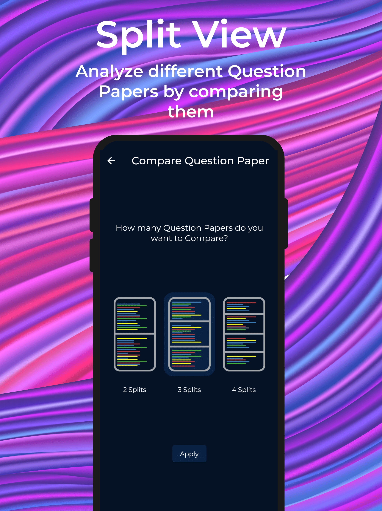

<h1 align="center">Paper For Peers</h1>
<h1 align="center">
  <!-- <a href="https://github.com/AdrianLopezGue/daruma-backend"></a> -->
	
  <br>
</h1>

An App where student can share Notes, Text Books, Question Papers, Syllabus Copy and Journals 
<br>
<br>
## Features

<!-- - Download all documents in App
- Compare Question Papers
- Students can rate ⭐ others notes.
- Light/dark mode toggle -->
<p align="center">
	
	
	
	
	
	
	
</p>

## Figma prototype Link 

[Paper-for-Peers prototype (Figma)](https://www.figma.com/file/LmRuY0YexLgv6gjllQE7Fl/Papers-for-Peers?node-id=1%3A2)

## Install, build and run!

After running backend server, clone and run this application, you'll need [Git](https://git-scm.com) installed on your computer. From your command line:

```bash
# Clone this repository
$ git clone https://github.com/pramodksh/paper-for-peers.git

# Go into the repository
$ cd paper-for-peers
```

Download Android Studio or Visual Studio with Flutter editor plugins. After that, open the project and install dependencies from pubspec.yaml by running the following command:
```bash
$ flutter pub get
```

## Built With

This software uses the following packages:

- [Flutter](https://flutter.dev/)
- [Dart](https://dart.dev/)
- [Android Studio](https://developer.android.com/)


## Screenshots
<p align="center">
	
	&nbsp;
	
	&nbsp;
	
	&nbsp;
	
	&nbsp;
	
	&nbsp;
	
	&nbsp;
	
	&nbsp;
	
</p>

## Contact

- [@akashpunagin](https://github.com/akashpunagin)
- [@pramodksh](https://github.com/pramodksh)    
